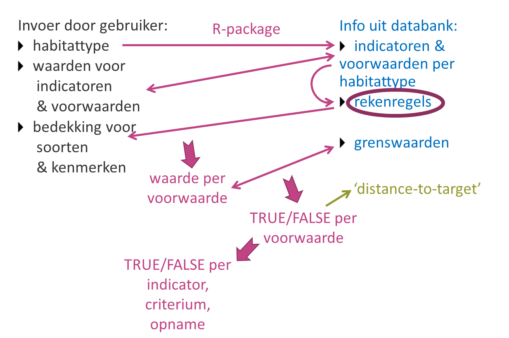

```{r setup, include=FALSE}
knitr::opts_chunk$set(echo = TRUE)
library(LSVI)
maakConnectiePool()
```

#Inleiding

De functie `berekenLSVIbasis` berekent de Lokale Staat van Instandhouding van habitattypen op basis van opnamen, maar wat gebeurt er eigenlijk onder de motorkap? Dit vignet geeft hier een antwoord op. (Voor inleidende informatie over het gebruik van het package verwijzen we naar het vignet handleiding (`vignette("Handleiding", package = "LSVI")`), en voor het gebruik van deze berekenfunctie verwijzen we naar de help van de functie in kwestie (`?berekenLSVIbasis`.)

##Beschikbare gegevens en informatie

De gebruiker kan per opname 3 typen informatie invoeren:

- habitattype: tabel die voor elke opname aangeeft volgens de criteria van welk habitattype de LSVI berekend moet worden
- waarden voor indicatoren en voorwaarden (facultatief, afhankelijk van beschikbare gegevens): tabel met per opname rechtstreeks ingeschatte waarden voor indicatoren en voorwaarden zoals die in de LSVI-criteria vermeld zijn
- bedekking voor soorten en/of kenmerken (facultatief, afhankelijk van beschikbare gegevens): tabel met per opname soorten en/of kenmerken en hun bedekkingen (of aan/afwezigheid), bv. gegevens die afkomstig zijn uit een volledige vegetatie-opname

De achterliggende databank bevat ook 3 soorten informatie (op te vragen met de functie `geefInvoervereisten()`):

- indicatoren en voorwaarden per habitattype (op basis waarvan de LSVI bepaald wordt)
- een grenswaarde ('Referentiewaarde') en operator voor elke voorwaarde (die aangeeft wanneer de staat gunstig of goed is)
- rekenregels (= alle nodige info om een voorwaarde te kunnen berekenen)

```{r}
str(geefInvoervereisten(Habitattype = "4030"))
```


#Algemene workflow

Wat de functie `berekenLSVIbasis()` doet na controle van de gebruikersinvoer, is in een notendop:

- voor het door de gebruiker ingegeven habitattype opzoeken in de databank welke indicatoren en voorwaarden berekend moeten worden
- de door de gebruiker ingegeven waarden voor indicatoren en voorwaarden hieraan koppelen
- voor de waarden die nog niet ingevuld zijn: in de databank de rekenregels opzoeken en voor elke voorwaarde een waarde proberen te berekenen op basis van de door de gebruiker ingegeven bedekkingen voor soorten en kenmerken
- voor elke voorwaarde de geobserveerde/berekende waarde vergelijken met de grenswaarde in de databank, en rekening houdend met de operator een status gunstig/ongunstig (TRUE/FALSE) bepalen en een verschilscore of distance-to-target berekenen
- de resultaten aggregeren naar de hogere niveaus (indicator, criterium, opname) en telkens een status en distance-to-target berekenen

```{r echo=FALSE, fig.cap="Schematische voorstelling van de workflow", out.width="100%"}

```

Deze workflow geeft dus voorrang aan rechtstreeks ingeschatte indicatoren en voorwaarden, wat doorgaans de meest accurate waarden zijn.  Dit betekent dat je als gebruiker door het opgeven van een voorwaarde met waarde NA kan aangeven dat je niet wil dat een bepaalde voorwaarde berekend wordt, omdat je weet dat het resultaat niet betrouwbaar gaat zijn (bijvoorbeeld omdat je niet van alle soorten een bedekking hebt ingeschat).

In wat volgt, wordt dieper ingegaan op de onderdelen waarin relevante 'berekeningen' gebeuren of die mogelijk vragen zouden kunnen oproepen:

- hoe worden die rekenregels precies uitgevoerd, wat betekent die 'AnalyseVariabele'?
- hoe werkt dat precies met die soortenlijsten, wat gebeurt er als ik niet exact dezelfde naam opgeef?
- wat als ik niet dezelfde schaal gebruik als de grenswaarde, hoe gebeurt die omzetting?
- hoe wordt de status precies bepaald?
- wat is distance-to-target en hoe wordt het berekend?

#Berekening van voorwaarden

##Inleiding

Veel voorwaarden voor de bepaling van de LSVI zijn gebaseerd op het tellen van aantallen en/of het inschatten/berekenen van bedekkingen van soorten of kenmerken.  Dit betekent dat de 'berekening' uitgaande van een volopname (met voor elke plantensoort een geschatte bedekking, eventueel aangevuld met andere vegetatiekenmerken) vaak een gelijkaardig stramien volgt, al zijn er soms aanzienlijke nuanceverschillen.  Enkele voorbeelden om dit te illustreren.

Voor de voorwaarde 'aantal sleutelsoorten minstens frequent aanwezig' zal het script de volgende stappen doorlopen:

- checkt in de databank de lijst met sleutelsoorten voor het habitattype in kwestie
- selecteert deze sleutelsoorten uit de opname die de gebruiker invoerde
- selecteert hieruit de soorten die minstens frequent aanwezig zijn
- telt dit aantal soorten

De voorwaarde 'aantal ouderdomsstadia minstens frequent aanwezig' kan op dezelfde manier berekend worden, maar dan op basis van een lijst (in de databank) die alle ouderdomsstadia weergeeft.  En uiteraard veronderstelt dit dat de gebruiker voor deze ouderdomsstadia een bedekking invoerde in de tabel met soorten en kenmerken.

Om de voorwaarde 'bedekking boomlaag' te berekenen, zal het script volgende stappen doorlopen:

- checkt of de gebruiker voor de boomlaag een totale bedekking ingeschat heeft (en gebruikt dan deze waarde als resultaat)
- indien niet:
    - selecteert alle boomsoorten uit de opname die in de boomlaag voorkomen (op basis van een lijst met alle boomsoorten uit de databank)
    - berekent de totale bedekking van deze soorten samen, rekening houdend met een gedeeltelijke overlap van de vegetatie

Het stukje 'selecteert de soorten/kenmerken uit de opname' komt in bijna alle voorwaarden terug.  Soms moet er achteraf nog een extra selectie gebeuren, bv. enkel soorten/kenmerken die minstens/maximum een bepaalde bedekking hebben of enkel soorten uit een bepaalde vegetatielaag, soms niet.  Vaak is het uiteindelijke eindresultaat een telling van het aantal soorten of een totale bedekking van alle soorten samen.  Soms wordt de totale bedekking van een volledige vegetatielaag gevraagd, en dan zal de rekenmodule de berekening op basis van de volopname/soortenlijst enkel doen als de totale bedekking van de vegetatielaag niet opgegeven is.

Globaal bekeken is het aantal verschillende handelingen/berekeningswijzen (oftewel stukjes script die nodig zijn) relatief beperkt, maar zoals de 'soms' en de 'vaak' in voorgaande alinea aangeven, moeten deze wel zeer flexibel ingezet kunnen worden afhankelijk van de voorwaarde.  Deze flexibiliteit is in het package opgevangen door voor elke voorwaarde de berekeningswijze als een set van 'rekenregels' te coderen in de databank.  Zo is de voorwaarde 'aantal sleutelsoorten minstens frequent aanwezig' als volgt gecodeerd:

```{r}
str(geefInvoervereisten(Versie = "versie 2.0" ,Habitattype = "2330_dw", Indicator = "sleutelsoorten", Kwaliteitsniveau = 1))
```

Scriptmatig wordt dus gecheckt welke variabelen ('rekenregels') in de databank ingevuld zijn en welke waarden ze hebben, en deze combinatie bepaalt welke stukjes script voor het bepalen van die voorwaarde doorlopen worden.  In enkele gevallen kan een variabele ietwat contextafhankelijk zijn, dus een lichtjes andere interpretatie hebben afhankelijk van de inhoud van andere variabelen.

##Rekenregels

De belangrijkste variabele in de rekenregels is `AnalyseVariabele`.  Deze verwijst rechtstreeks naar een welbepaald script dat leidt tot de bepaling van de LSVI voor die voorwaarde.  Er zijn enkele basisscripts, zoals bv. AnalyseVariabelen `aantal` en `bedekking`, die een globale workflow bevatten die door de meeste scripts min of meer overgenomen wordt.  De afgeleide scripts ('nakomelingen' van `aantal` of `bedekking`) doen vaak dezelfde handeling maar voorafgegaan en/of gevolgd door een extra handeling.  Zo berekent `bedekking` de totale bedekking van alle opgegeven soorten die in de taxonlijst staan (rekening houdend met overlap), terwijl `bedekkingLaag` eerst checkt of er een totale bedekking ingeschat is voor de opgegeven laag.  Indien niet, dan gebruikt ze de procedure van `bedekking` om de totale bedekking te berekenen voor alle soorten die in deze vegetatielaag voorkomen (op basis van een taxonlijst die bv. alle bomen (voor boomlaag) of alle mossen (voor moslaag) bevat).

Bij de verschillende analysevariabelen kan het gebruik of de interpretatie van de variabelen in de databank afwijkend zijn.  Zo berekent bijvoorbeeld de AnalyseVariabele `bedekkingExcl` de totale bedekking van alle soorten van de opname behalve deze die in de taxonlijst vermeld staan (terwijl bij andere berekeningen de soorten in de taxonlijst net wel in beschouwing genomen worden).  Om een berekening ten volle te begrijpen, is het dus belangrijk om de beschrijvingen van de berekeningswijzen voor de verschillende analysevariabelen verderop in dit hoofdstuk door te nemen.  Het deel van de workflow dat ze bijna allemaal gemeenschappelijk hebben, is beschreven in een eerste onderdeeltje [AnalyseVariabele](#AnalyseVariabele).

Meestal is er ook een variabele `TaxongroepId` of een studielijst (variabelen `Studielijstnaam` en `Studiewaarde`) toegevoegd.  Deze verwijzen naar de voor de voorwaarde relevante soortenlijst(en) of kenmerken.  Een voorbeeld van een studielijst zijn de ouderdomsklassen van heide.  Idee is dat de gebruiker voor elk van de kenmerken (in dit geval ouderdomsklassen) een  waarde (in dit geval bedekking) opgeeft, en op basis hiervan wordt bv. 'berekend' hoeveel klassen er minstens frequent aanwezig zijn.  Voor de studielijsten staan de kenmerken rechtstreeks opgesomd onder `Studiewaarde`.

Om de tabel niet te overladen, zijn de soortenlijsten niet rechtstreeks toegevoegd in de tabel, maar vervangen door een verwijzing naar een `TaxongroepId`.  De volledige lijst van bv. `TaxongroepId` 123 kan opgevraagd worden met het commando `geefSoortenlijstVoorIDs("123")` (en in de string kunnen meerdere Id's gescheiden door een `,` opgegeven worden).

Om een gebruiker niet te verplichten om ook alle soorten in te geven die hij niet gezien heeft, gaat de rekenmodule ervan uit dat er voor de soorten een volopname gebeurd is van zodra er minstens 1 soort toegevoegd is aan de tabel met soorten en kenmerken.  Concreet zal hij in dit geval alle niet ingevoerde soorten beschouwen als afwezig of soorten met een bedekking van 0 %.  Als er geen enkele soort ingevoerd is, zullen voorwaarden in verband met soorten die niet rechtstreeks ingeschat zijn, de waarde NA krijgen.  En voor kenmerken is hetzelfde principe toegepast: zodra 1 kenmerk van een bepaalde studielijst opgegeven is, gaat de rekenmodule ervan uit dat de andere kenmerken van die lijst niet aanwezig waren (bv. als pioniersstatium opgegeven is, zal er voor ouderdomsklassen van uitgegaan worden dat de andere klassen afwezig waren).  Ingeval van gedeeltelijke opnamen is het dus aan de gebruiker om voor elke voorwaarde in te schatten in hoeverre het resultaat betrouwbaar is en evt. rechtstreeks een waarde op te geven voor de voorwaarde.

Binnen een voorwaarde kan ook een 'subvoorwaarde' gedefinieerd zijn (opgesplitst in meerdere variabelen met 'Sub' in de naam), die een bijkomend selectiecriterium geeft dat toegepast wordt op alle soorten en/of kenmerken uit de lijst.  Zo is de subvoorwaarde 'minimaal frequent aanwezig' uit bovenstaand voorbeeld gecodeerd met o.a.:

- `subAnalyseVariabele` 'bedekking'
- `TypeSubvariabele` 'Categorie'
- `Subreferentiewaarde` 'f' (-> frequent)
- `SubOperator` '>='

Tenslotte zijn er nog een aantal variabelen die verschillen in gebruikte schalen of meeteenheden opvangen.  Zo geven `Type`(`Sub`)`Variabele`, (`Sub`)`Invoertype` en (`Sub`)`Invoerwaarde` aan wat voor variabele de (`Sub`)`Referentiewaarde` in de databank is, waardoor de gebruiker niet verplicht is om dezelfde variabele en eenheid te gebruiken.  Voor verdere uitleg hierover verwijzen we naar het onderdeel over [Bedekking en Schalen](#bedekkingEnSchalen).

##AnalyseVariabele {#AnalyseVariabele}

Bij het berekenen van een AnalyseVariabele wordt vaak de (interne) functie `selecteerKenmerkenInOpname` aangeroepen om de soorten/kenmerken uit de opname van de gebruiker te selecteren.  Om de workflow van deze functie niet te herhalen in elk van onderstaande analysevariabelen (berekeningswijzen), bespreken we hem hier apart.

In te voeren parameters voor deze functie zijn de door de gebruiker ingevoerde opname (soorten en/of kenmerken) en de velden die in de databank gedefinieerd zijn voor de voorwaarde.  De workflow van de functie is als volgt:

Als een taxonlijst of studielijst vermeld is in de voorwaarde, zullen de elementen uit deze lijst geselecteerd worden in de opname van de gebruiker.  Als zowel taxonlijst als studielijst vermeld zijn, dan bestaat deze studielijst altijd uit een of meerdere vegetatielagen, en dan worden de soorten uit de taxonlijst geselecteerd in de opname van de gebruiker die in de in de studielijst vermelde vegetatiela(a)g(en) voorkomen.

Als er een subvoorwaarde vermeld is in de voorwaarde, zullen uit de geselecteerde deellijst van de opname enkel de elementen geselecteerd worden die aan de subvoorwaarde voldoen (bv. minimum of maximum een bepaalde bedekking of aandeel zijn).

Zoals eerder aangegeven, zal een opname zonder soorten (ingeval van taxonlijst) of kenmerken (ingeval van studielijst) resulteren in NA.

Voor taxonlijsten is de routine iets complexer dan hierboven beschreven, maar deze details zijn uitgebreid beschreven in het hoofdstuk [Afhandeling taxonlijsten](#taxonlijsten).

##aantal

Bij de voorwaarden met analysevariabele `aantal` wordt het aantal records (soorten of kenmerken) geteld dat door `selecteerKenmerkenInOpname` teruggegeven wordt, dus hier wordt simpelweg het aantal relevante soorten (ingeval van taxonlijst) of kenmerken (ingeval van studielijst) geteld dat voorkomt in de door de gebruiker ingegeven opname en voldoet aan een eventuele subvoorwaarde.  Als samen met een taxonlijst ook een studielijst opgegeven wordt, dan is deze te interpreteren als een tweede subvoorwaarde.  In de praktijk gaat het hier over de vegetatielaag waarin de soorten moeten voorkomen.

##bedekking {#bedekking}

Bij de voorwaarden met analysevariabele `bedekking` wordt de totale bedekking berekend van de records (soorten of kenmerken) die door `selecteerKenmerkenInOpname` teruggegeven worden, dus hier wordt de totale bedekking berekend van de relevante soorten (ingeval van taxonlijst) of kenmerken (ingeval van studielijst) die voorkomen in de door de gebruiker ingegeven opname en voldoen aan een eventuele subvoorwaarde.  Als samen met een taxonlijst ook een studielijst opgegeven wordt, dan is deze te interpreteren als een tweede subvoorwaarde.  In de praktijk gaat het hier over de vegetatielaag waarin de soorten moeten voorkomen.

Voor de berekening van de totale bedekking wordt gebruik gemaakt van de formule van Fisher: 

$$ b_{tot} = 1 - \prod_{i=1}^n (1 - b_{i})$$
met $b_{tot}$ de totale bedekking in proportie (dus percentage / 100), $b_{i}$ de bedekking van de individuele soorten in proportie (dus percentage / 100) (en $\prod$ het product)

Deze formule geeft uiteraard maar een benaderende waarde die minder accuraat is dan een rechtstreekse inschatting van de totale bedekking van de soorten van de lijst samen (dus gebruik maken van rechtstreekse inschattingen heeft de voorkeur als deze beschikbaar zijn).  In tegenstelling tot een gewone som van bedekkingen, gaat ze uit van een gedeeldelijke overlap van soorten, wat vaak een betere benadering zal zijn.  Een ander pluspunt is dat het resultaat (de totale bedekking) nooit meer dan 1 of 100 % zal zijn.

##bedekkingExcl

Bij de analysevariabele `bedekkingExcl` gaat de voorwaarde over de totale bedekking van de soorten/kenmerken die niet in een lijst voorkomen, bv. alle soorten behalve de sleutelsoorten.

Bij voorwaarden met deze analysevariabele worden de soorten/kenmerken geselecteerd op basis van een functie `deselecteerKenmerkenInOpname`, die in de opname van de gebruiker de soorten/kenmerken schrapt die in de taxonlijst/studielijst voorkomen.  Verder gebeurt de berekening analoog aan deze van de analysevariabele `bedekking`

##bedekkingLaag

Bij de analysevariabele `bedekkingLaag` gaat de voorwaarde over de totale bedekking van een vegetatielaag, bv. de boom- en struiklaag of de moslaag.  In dit geval is de vegetatielaag in kwestie als studielijst ingegeven (met evt. de verschillende deellagen zoals boomlaag en struiklaag ook vermeld als aparte items), en de taxonlijst bevat een lijst van alle soorten die in deze laag voorkomen.

Bij voorwaarden met deze analysevariabele zal eerst gecheckt worden of kenmerken uit de studielijst voorkomen in de opname van de gebruiker.

- Als dat zo is, dan zal de bedekking afgeleid worden van het kenmerk of de kenmerken in de studielijst.  (Meer concreet: de berekening gebeurt zoals bij analysevariabele `bedekking` nadat eerst `TaxongroepId` uit de voorwaarden geschrapt is, dus de selectie van de lagen gebeurt op basis van enkel de studielijst)
- Als dat niet zo is, dan zal de bedekking afgeleid worden op basis van opgegeven taxonlijst en zal de voorwaarde uitgevoerd worden na enkel de analysevariabele te vervangen door `bedekking` (dus de studielijst met de vegetatielaag blijft behouden, waardoor enkel soorten uit die laag geselecteerd zullen worden)

##bedekkingLaagExcl

De analysevariabele `bedekkingLaagExcl` is zeer analoog aan `bedekkingLaag`, maar lost een taxonlijst-gerelateerd probleem op dat voorkomt bij de taxonlijst van de boomlaag.  Om ervoor te zorgen dat ook in de opname van de gebruiker ingevoerde genera als boom beschouwd worden, bestaat de lijst van bomen en struiken uit genera.  Lagere taxonomische niveaus worden automatisch ook meegenomen (zie [Afhandeling taxonlijsten](#taxonlijsten)).  Er is echter 1 moeilijkheid: _Salix repens_ zou niet meegenomen mogen worden want dit is geen boom (die wel in de struiklaag zou kunnen voorkomen).  Anderzijds zijn er een aantal moeilijk te determineren _Salix_-soorten die evt. als genus in een opname zou kunnen voorkomen, maar die allen bomen zijn.  We gaan ervan uit dat _Salix repens_ wel herkend wordt en dus tot op soortniveau in een opname toegevoegd zal worden, en enkel moeilijk te herkennen _Salix_-soorten als genus toegevoegd worden.  Vanuit die redenering worden '_Salix_ sp.' en de _Salix_-soorten als boom beschouwd, met uitzondering van _Salix repens_.

Dit probleempje heeft aanleiding gegeven voor een nieuwe analysevariabele, die uiteraard ook ruimer gebruikt kan worden.  Bij voorwaarden met deze analysevariabele verwijst het `TaxongroepId` naar een taxonlijst bestaande uit 2 sublijsten: een lange lijst (bv. alle genera van bomen) en een kort lijstje (bv. _Salix repens_).

Bij de berekening zal eerst gecheckt worden of er inderdaad 2 sublijsten zijn, en in dat geval zullen als een eerste stap de taxa van het kortste lijstje geschrapt worden in de lijst van de taxa met het langste lijstje (in een lijst waarin alle mogelijke taxonniveaus toegevoegd zijn).  Daarna zal met de eventueel aangepaste taxonlijst de voorwaarde uitgerekend worden volgens analysevariabele `bedekkingLaag`.

##bedekkingLaagPlus

Bij de analysevariabele `bedekkingLaagPlus` gaat de voorwaarde over de totale bedekking van een vegetatielaag en een taxongroep, bv. de bedekking van de moslaag en klimop.  Verschillend van `bedekkingLaag` verwijst het `TaxongroepId` naar een taxonlijst met 2 taxonsublijsten (zie [Afhandeling taxonlijsten](#taxonlijsten)): een lange lijst met alle soorten van de vegetatielaag die in studielijst vermeld is (in het voorbeeld alle mossen), en een korte lijst met de soorten waarvan de bedekking hierbij opgeteld moet worden (in het voorbeeld klimop).

Bij de berekening zal eerst gecheckt worden of er inderdaad 2 sublijsten zijn, en in dat geval worden deze opgesplitst in 2 lijsten.  Op basis van de kortste lijst wordt de bedekking van deze soort(en) berekend volgens de analysevariabele `bedekking` (waarbij de studielijst buiten beschouwing gelaten wordt).  Op basis van het langste lijst en de studielijst wordt de bedekking van de vegetatielaag berekend volgens de analysevariabele `bedekkingLaag`.  Daarna wordt de voorwaarde berekend door beide bedekkingen op te tellen volgens de formule van Fisher (zie onder [bedekking](#bedekking)).  (Ingeval er geen 2 sublijsten zijn, zal de voorwaarde als weergegeven in de databank, berekend worden volgens analysevariabele `bedekkingLaag`).

##bedekkingSom

Bij de analysevariabele `bedekkingSom` gaat de voorwaarde over de totale bedekking van een taxongroep en een studiegroep, bv. de bedekking van pioniersvegetatie en open zand.

De bedekkingen worden berekend volgens de analysevariabele `bedekking` voor enerzijds de studielijst (waarbij `TaxongroepId` buiten beschouwing gelaten wordt), en anderzijds voor `TaxongroepId` (waarbij de studielijst buiten beschouwing gelaten wordt).  Daarna wordt de voorwaarde berekend door beide bedekkingen op te tellen.  Vermits de studielijst doorgaans geen vegetatie bevat, wordt niet uitgegaan van een gedeeltelijke overlap en wordt een gewone som gebruikt.

##maxBedekking

Bij de voorwaarden met analysevariabele `maxBedekking` wordt de maximale bedekking geselecteerd uit de records (soorten of kenmerken) die door `selecteerKenmerkenInOpname` teruggegeven worden (zie onder [AnalyseVariabele](#AnalyseVariabele)), dus hier wordt de soort of kenmerk met de hoogste bedekking geselecteerd uit de relevante soorten (ingeval van taxonlijst) of kenmerken (ingeval van studielijst) die voorkomen in de door de gebruiker ingegeven opname en voldoen aan een eventuele subvoorwaarde.  Als samen met een taxonlijst ook een studielijst opgegeven wordt, dan is deze te interpreteren als een tweede subvoorwaarde.  In de praktijk gaat het hier over de vegetatielaag waarin de soorten moeten voorkomen.

##maxBedekking2s

De analysevariabele `maxBedekking2s` is gelijkaardig aan `maxBedekking` met als enige verschil dat bij 2 of meer aanwezige soorten of kenmerken, de bedekkingen van de 2 soorten/kenmerken met de hoogste bedekking opgeteld worden volgens de formule van Fisher (zie onder [bedekking](#bedekking)).

##maxBedekkingExcl

Bij de analysevariabele `maxBedekkingExcl` gaat de voorwaarde over de maximale bedekking van de soorten/kenmerken die niet in een lijst voorkomen, bv. alle soorten behalve de sleutelsoorten.

Bij voorwaarden met deze analysevariabele worden de soorten/kenmerken geselecteerd op basis van een functie `deselecteerKenmerkenInOpname`, die in de opname van de gebruiker de soorten/kenmerken schrapt die in de taxonlijst/studielijst voorkomen.  Verder gebeurt de berekening analoog aan deze van de analysevariabele `maxBedekking`

##aandeel

Bij de analysevariabele `aandeel` gaat de voorwaarde over grondvlakken of volumes van bomen.  Terwijl alle andere analysevariabelen enkel door gebruikers ingevoerde records in beschouwing nemen waarbij `Eenheid` niet gelijk is aan 'grondvlak_ha' of 'volume_ha', zal deze analysevariabele deze records net wel in beschouwing nemen (en alle andere records wissen).

Om het totale grondvlak of volume te berekenen van de relevante soorten, wordt de som genomen van de grondvlakken/volumes van de records (in principe soorten, maar voor kenmerken zou het technisch ook werken) die door `selecteerKenmerkenInOpname` teruggegeven worden (zie  onder [AnalyseVariabele](#AnalyseVariabele)), dus hier wordt het totale grondvlak of volume berekend van de relevante soorten (uit taxonlijst) die voorkomen in de door de gebruiker ingegeven opname en voldoen aan een eventuele subvoorwaarde.  Als samen met een taxonlijst ook een studielijst opgegeven wordt, dan is deze te interpreteren als een tweede subvoorwaarde.  In de praktijk gaat het hier over de vegetatielaag waarin de soorten moeten voorkomen.

Om tenslotte het aandeel te berekenen, wordt het bekomen grondvlak of volume gedeeld door het totale grondvlak of volume van alle opgegeven soorten, wat de som is van alle soorten in de opname met `Eenheid` 'grondvlak_ha' of 'volume_ha'.

##aandeelKruidlaag

De analysevariabele `aandeelKruidlaag` heeft eigenlijk een ietwat slecht gekozen naam, omdat de functie in principe het aandeel ten opzichte van eender welke vegetatielaag berekent.  Bij voorwaarden met deze analysevariabele verwijst `TaxongroepId` naar een lijst met de relevante soorten om het aandeel te berekenen, en studielijst vermeldt de vegetatielaag waarin dit aandeel bestudeerd wordt.

De totale bedekking van de relevante soorten wordt berekend door de voorwaarde (met `TaxongroepId` en studielijst) te berekenen volgens de analysevariabele `bedekking`.  Voor de totale bedekking van de vegetatielaag zal eerst gecheckt worden of het kenmerk uit de studielijst (de vegetatielaag) voorkomt in de opname van de gebruiker.

- Als dat zo is, dan zal de bedekking afgeleid worden van het kenmerk in de studielijst.
- Als dat niet zo is, dan zal de bedekking afgeleid worden van de opname van de gebruiker waaruit enkel soorten van de vegetatielaag in kwestie (bepaald op basis van studielijst) gefilterd zijn.

Om de voorwaarde te berekenen, zal de totale bedekking van de relevante soorten gedeeld worden door de totale bedekking van de vegetatielaag.
<!-- Het tweede deel van de berekening lijkt wat op bedekkingLaag, maar is niet helemaal hetzelfde (er wordt uitgegaan van de veronderstelling dat er maar 1 vegetatielaag opgegeven is in studielijst, alle soorten uit de opname uit de laag worden meegenomen,...).  Omwille van het laatste verschil kan bedekkingLaag op het eerste zicht moeilijk als alternatief gebruikt worden. -->

##aantalGroepen

De analysevariabele `aantalGroepen` gaat specifiek over kenmerken die eigenlijk soortenlijsten zijn, bv. helofyten.  Deze kenmerken zijn in de databank enerzijds weergegeven in de studielijst, en anderzijds verwijst het `TaxongroepId` naar een taxonlijst met meerdere taxonsubgroepen die elk overeenkomen met een van de kenmerken (en die de relevante soorten bevatten).

Bij voorwaarden met deze analysevariabele zal eerst gecheckt worden of kenmerken uit de studielijst voorkomen in de opname van de gebruiker.

- Als dat zo is, dan zal het aantal afgeleid worden van de kenmerken in de studielijst.  (Meer concreet: de berekening gebeurt zoals bij analysevariabele `aantal` nadat eerst `TaxongroepId` uit de voorwaarden geschrapt is)
- Als dat niet zo is, dan zal het aantal afgeleid worden op basis van opgegeven taxonlijst.  Concreet zal de originele voorwaarde wat aangepast worden (de studielijst wordt geschrapt en de taxonlijst wordt herwerkt zodat de originele taxonsubgroepen afzonderlijke taxa of soorten worden binnen 1 taxonlijst), waarna de berekening van het aantal groepen/kenmerken kan gebeuren volgens de analysevariabele `aantal`.  (Zoals beschreven in [Afhandeling taxonlijsten](#taxonlijsten) hieronder, zal de aggregatie van de opgegeven soorten - die nu als subsoorten beschouwd worden - gebeuren door de totale bedekking te berekenen en op de resulterende lijst de eventuele subvoorwaarde uit te voeren, waarna het aantal originele taxonsubgroepen - nu hernoemd als soorten - geteld wordt.)

##meting

De analysevariabele `meting` (of `meting_xxx`) staat in de databank bij voorwaarden waarvoor geen specifieke berekeningswijze ontwikkeld is.  Voorlopig is de bedoeling dat voor deze voorwaarden een waarde ingevoerd wordt via `Data_voorwaarden`; de berekening van deze analysevariabele geeft een foutmeldig als dit niet het geval is.  Idee is om op termijn op zoek te gaan naar een oplossing om ingevoerde kenmerken in de mate van het mogelijke toch te koppelen aan voorwaarden van deze analysevariabele.

#Afhandeling taxonlijsten {#taxonlijsten}

Idealiter worden de door de gebruiker ingevoerde taxonnamen herkend en correct behandeld bij de berekening.  Om dit zo goed mogelijk op te vangen, bevat de databank:

- taxa van meerdere taxonomische niveaus (genera, soorten, ondersoorten,...) en hun onderlinge verwantschap
- zowel ‘preferred names’ als ‘junior synonyms’ (bij opgevraagde info worden enkel preferred names gegeven, de junior synonyms dienen enkel om door gebruikers ingevoerde namen te herkennen)
- Latijnse en Nederlandse namen
- de binnen INBO gebruikte NbnTaxonVersionKey die een unieke code is voor een taxon

Voor Latijnse namen gebeurt herkenning op basis van genusnaam + soortnaam + evt. subsoortnaam/variëteit/….  Om de koppeling met namen uit de databank toe te laten, worden de door een gebruiker ingevoerde namen deze eerst scriptmatig aangepast naar dit formaat met de functie `parseTaxonnaam()` (waarbij o.a. auteursnamen worden weggelaten zodat verschillen in schrijfwijzen of al dan niet gebruiken van een '.' hierin geen probleem vormen).  Bij Nederlandse namen moet de schrijfwijze wel exact hetzelfde zijn om herkenning toe te laten.

Als de gebruiker een onbekende naam invoert, krijgt hij een waarschuwing en wordt deze naam bij de berekeningen buiten beschouwing gelaten (ook voor bv. de berekening van een totale bedekking van alle soorten of een bepaalde vegetatielaag).  Anders wordt de naam omgezet naar de NbnTaxonVersionKey van de ‘preferred name’, die intern gebruikt wordt voor de verdere berekeningen.  Als gebruiker kan je ook rechtstreeks deze unieke code invoeren (dan gebeurt de hier beschreven stap om de naam te herkennen niet).

Bij het selecteren van soorten uit de opname op basis van een taxonlijst in de databank (met `selecteerKenmerkenInOpname`, zie  onder [AnalyseVariabele](#AnalyseVariabele)), wordt voor de taxa in de databank eerst gecheckt of ze in de opname voorkomen.  Als een taxon niet gevonden wordt (bv. _Quercus_), wordt gezocht of taxa van een lager niveau wel in opname voorkomen (bv. _Quercus robur_, _Quercus petraea_,...).  Als er meerdere taxa van dit lagere niveau voorkomen, dan worden deze bedekkingen geaggregeerd door middel van de formule van Fisher (zie onder [bedekking](#bedekking)).  Op deze lijst gebeurt de uiteindelijke bewerking als beschreven bij de analysevariabelen (aantallen tellen, bedekkingen aggregeren,...).

Een soortenlijst met toevoeging van deze taxa van lagere niveaus kan opgevraagd worden door bij functies `geefSoortenlijst()` of `geefSoortenlijstVoorIDs()` de parameter `Taxonlijsttype = "alle"` toe te voegen.  In de verkregen lijst zijn de taxa van het hoogste niveau de records waar `TaxonId` en `SubTaxonId` dezelfde waarde hebben.  De taxa van een lager niveau hebben hier een verschillende waarde, en ze hebben dezelfde `TaxonId` als het bijhorend taxon van het hoogste niveau.

Voor enkele analysevariabelen (`bedekkingLaagPlus`, `bedekkingLaagExcl` en `aantalGroepen`) zijn 2 soortenlijsten nodig voor de berekening.  Dit is opgelost door een lijst te maken (aangeduid met eenzelfde `TaxongroepId`) met 2 sublijsten (elk aangeduid met eenzelfde `TaxonsubgroepId`).  Bij `bedekkingLaagPlus` en `bedekkingLaagExcl` wordt deze lijst op basis van `TaxonsubgroepId` opgesplitst in 2 afzonderlijke lijsten, en de bewerking gebeurt op lijsten zonder sublijsten.  Bij `aantalGroepen` zijn de Id's hernoemd om code van analysevariabele `aantal` te kunnen herbruiken:

- `TaxonsubgroepId` -> `TaxonId` zodanig dat de originele `TaxongroepId`'s aanzien worden als de items (soorten) die geteld moeten worden
- `TaxongroepId` -> `TaxonsubgroepId` zodanig dat de nieuwe `TaxonId`'s onder 1 taxonsubgroep vallen

Ook bij andere analysevariabelen kan een taxonlijst opgesplitst zijn in sublijsten, meestal als gevolg van het feit dat deze sublijsten bij andere voorwaarden als aparte lijst gebruikt worden.  In deze gevallen is de opsplitsing in sublijsten een louter praktisch gegeven en heeft het geen invloed op de berekening.

#Bedekking en schalen {#bedekkingEnSchalen}

Ook voor de invoer van bedekkingen heeft de gebruiker enige flexibiliteit en is hij niet verplicht om dezelfde bedekkingsschaal te gebruiken als de opgegeven grenswaarde bij de voorwaarde in kwestie.  Een gebruiker kan een bedekking invoeren op 3 manieren:

- als percentage of overeenkomstig decimaal getal
- als interval van 2 percentages (bv. 20–30) of decimale getallen
- als waarde uit een Tansley-schaal of beheermonitoringschaal

Er moet wel telkens aangegeven worden over welk type variabele het gaat (`TypeVariabele`, bv. Percentage, Decimaal getal, Categorie) en bij een categorische variabele moet ook de gebruikte schaal opgegeven worden (`Invoertype`, bv. TANSLEY IHD).  Bij een interval wordt het type opgegeven van de variabelen die als onder- of bovengrens opgegeven zijn, bv. Percentage of Decimaal getal.

Voor de berekeningen worden deze waarden intern omgezet naar intervallen.  De onder- en bovengrenzen die hierbij voor de verschillende schalen gehanteerd worden, kunnen opgevraagd worden via `geefVertaallijst(ConnectiePool)`.  De berekeningen gebeuren voor de boven- en ondergrens afzonderlijk, met als resultaat een nieuw interval.<!--nog aanpassen als we fuzzy logic gebruiken!-->  Voor de weergave van het resultaat worden voor rechtstreeks ingevoerde voorwaarden de door de gebruiker opgegeven waarden overgenomen; berekende waarden worden weergegeven in dezelfde schaal als de voorwaarde (LSVI-criterium).

#Status

Om de status van een voorwaarde te berekenen, worden de onder- en bovengrenzen met elkaar vergeleken (gebruik makend van functie `berekenStatus()`):

- voor operator '<' de bovengrens van de waarde met de ondergrens van de grenswaarde
- voor operator '<=' de bovengrens van de waarde met de bovengrens van de grenswaarde
- voor operator '>' de ondergrens van de waarde met de bovengrens van de grenswaarde
- voor operator '>=' de ondergrens van de waarde met de ondergrens van de grenswaarde
- voor operator '=' beide ondergrenzen en beide bovengrenzen (idee is dat het interval van waarde gelijk is aan het interval van de grenswaarde of er volledig binnen valt)

Het resultaat is telkens een logische waarde die aangeeft of de voorwaarde gunstig (TRUE) of ongunstig (FALSE) scoort.

Om de status van een indicator te berekenen, wordt de aggregatie uitgevoerd die bij `geefInvoervereisten()` in het veld `Combinatie` weergegeven is (meestal een combinatie van voorwaarden met operatoren AND en OR), waarbij de resultaten TRUE/FALSE ingevuld worden bij de respectievelijke voorwaarden (gebruik makend van functie `combinerenVoorwaarden()`).

Voor de aggregatie naar hogere niveaus (criterium en volledige opname) worden deze resultaten normaal verder geaggregeerd met een AND-operator (als parameter aggregatiemethode de default '1-out-all-out' is).  Als een gebruiker kiest voor de aggregatiemethode 'RapportageHR', dan wordt rekening gehouden met het feit of een indicator belangrijk (`Belang` = 'b') of zeer belangrijk is (`Belang` = 'zb').  De beoordeling is gunstig (TRUE) als meer dan 50 procent van de indicatoren gunstig zijn EN als geen enkele zeer belangrijke indicator ongunstig is.

#Distance-to-target

Eerst worden verschilscores voor elk van de voorwaarden berekend met de functie `berekenVerschilscores()`:

- theoretisch maximum bepalen voor de voorwaarde:<!--zou idealiter in de databank toegevoegd worden-->
    - voor bedekkingen en aandelen is dit 1 of 100 % (ook als de grenswaarde een categorische variabele is)
    - voor het aantal soorten/kenmerken is dit het minimum van:
        - het aantal soorten/kenmerken van de lijst in de databank
        - 3 keer de grenswaarde
    - voor gemeten waarden is dit 3 keer de grenswaarde, m.u.v.
        - het maximum voor aantal geslachten (van jeneverbes) is 2
        - voor bosconstantie is het maximum begrensd op 250 (~ leeftijd van Ferrariskaart)
- theoretisch minimum is in elk van deze gevallen 0
- voor elke voorwaarde een 'gunstig bereik' en 'ongunstig bereik' berekenen op basis van theoretisch minimum en theoretisch maximum, en de operator en de grenswaarde in de databank
- de verschilscore wordt berekend door het verschil tussen de score en de grenswaarde te delen door het 'gunstig bereik' (in geval van gunstige status) of het 'ongunstig bereik' (in geval van ongunstige status); het resultaat krijgt een negatief teken bij een ongunstige score en een positief teken bij een gunstige score
- voor voorwaarden die enkel de waarden ja en nee kunnen aannemen, kan de verschilscore enkel de waarden -1 (ongunstig) en 1 (gunstig) aannemen.

Om de verschilscore van een indicator te berekenen, wordt rekening gehouden met de aggregatie 
die bij `geefInvoervereisten()` in het veld `Combinatie` weergegeven is (meestal een combinatie van voorwaarden met operatoren AND en OR).  Net als bij status worden de resultaten, in dit geval de verschilscores, ingevuld bij de respectievelijke voorwaarden.  Voor de berekening wordt bij de AND-operator het minimum van beide scores genomen, en bij de OR-operator het maximum.  Deze berekening gebeurt met de functie `combinerenVerschilscore()`.

Voor de aggregatie naar het criterium worden deze resultaten op 2 manieren verder geaggregeerd:

- een strenge beoordeling waarbij de redenering van de AND-operator gevolgd wordt, dus door het minimum te nemen (= index_min)
- een minder strenge beoordeling waarbij het harmonisch gemiddelde van de verschilscores genomen wordt (=index_harm)

Voor de aggregatie naar de volledige opname worden dezelfde 2 aggregatiemethoden opnieuw gebruikt uitgaande van de geaggregeerde resultaten op criteriumniveau.  
Doordat de verschilscore index_min volgens de 2 methoden geaggregeerd wordt, resulteert dat in 3 verschillende eindscores van streng naar liberaal:

- index_min_min: telkens het minimum genomen, dus de strengste beoordeling
- index_min_harm: het harmonisch gemiddelde genomen van index_min
- index_harm_harm: het harmonisch gemiddelde genomen van index_harm, dus de minst strenge beoordeling
